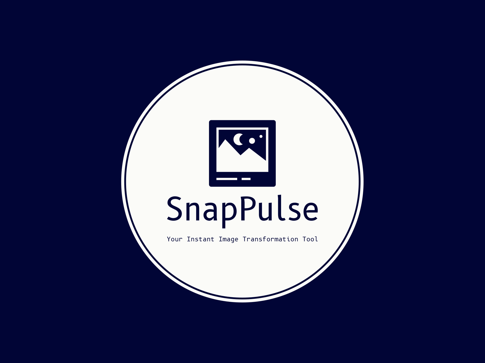

<H1 align="center">
📸 SnapPulse: Your Browser's Photo Studio
</H1>

  

Transform your images with the power of a professional studio, right in your browser!

## 🌟 What is SnapPulse?
SnapPulse isn't just another image editor – it's your personal photo laboratory in Chrome! With a sleek interface and powerful features, SnapPulse empowers you to unleash your creativity without ever leaving your browser.

## 🚀 Features that Pack a Punch

### 🎨 Real-time Magic
- **Live Filtering:** Watch your images transform as you slide! Brightness, saturation, inversion, and grayscale at your fingertips.
- **Rotation & Flipping:** Give your images a new perspective with our intuitive rotation and flipping tools.

### 📏 Precision Control
- **Smart Resizing:** Resize your images with pixel-perfect accuracy. Our aspect ratio lock ensures your images never lose their proportion.
- **Quality Optimization:** Balancing file size and quality has never been easier. Reduce quality for smaller files without sacrificing too much detail.

### 💾 Seamless Workflow
- **Quick Upload:** Select your image with a simple click and start editing immediately. It's that easy!
- **Instant Save:** Your masterpiece is ready? Save it with a single click, right from your browser.
- **Easy Reset:** Made a mistake? No worries! Reset all filters with one button press.

## 🛠️ Tech Stack & Skills Showcase

### 🌐 Web Technologies
- **HTML5:** Structuring a complex application with semantic markup.
- **CSS3:** Creating a responsive, visually appealing interface with advanced styling techniques.
- **JavaScript (ES6+):** Implementing complex functionalities with modern JS features.

### 🧩 Chrome Extension Expertise
- **Manifest V3:** Leveraging the latest in Chrome extension technology for enhanced security and performance.
- **Chrome API Integration:** Seamlessly integrating with Chrome's ecosystem for a native feel.

### 📊 Image Processing Prowess
- **Canvas API Mastery:** Utilizing HTML5 Canvas for high-performance image manipulations.
- **File API Handling:** Efficient management of file uploads and downloads.

### 💻 Programming Excellence
- **Modular Architecture:** Well-structured, maintainable code that's a joy to work with.
- **Performance Optimization:** Smooth user experience with efficient DOM manipulation and requestAnimationFrame usage.
- **Error Handling:** Robust error management for a frustration-free user experience.

  Made with ❤️ by Shorya Raj

